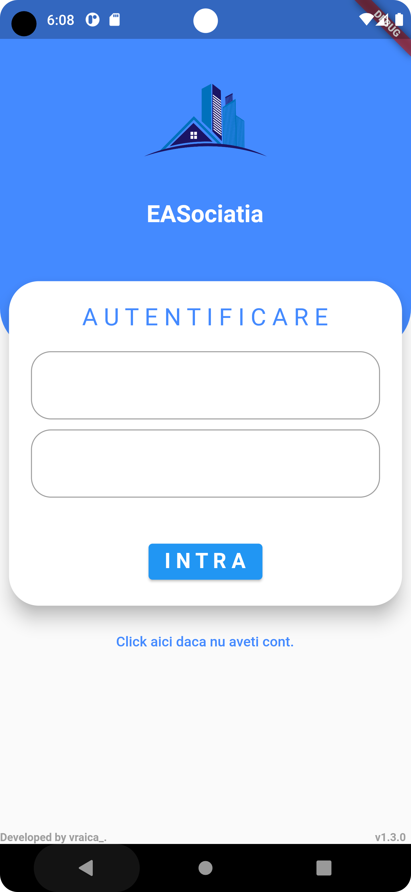
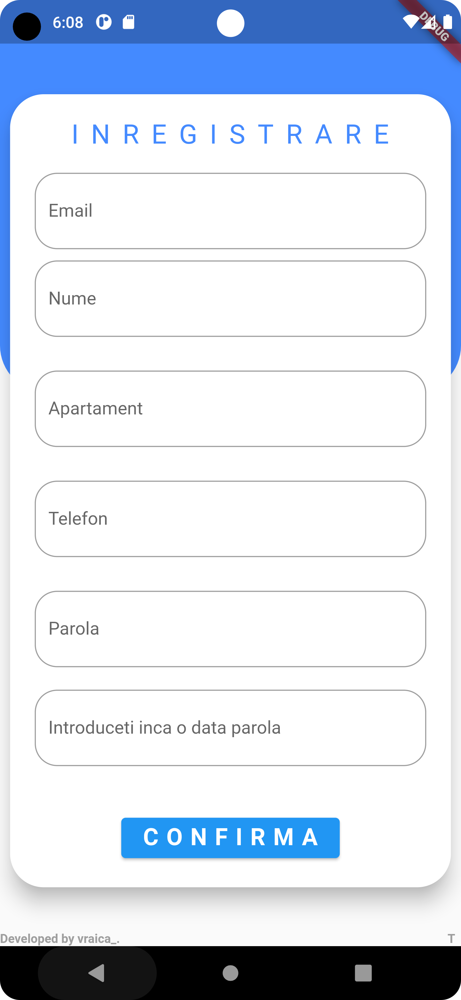
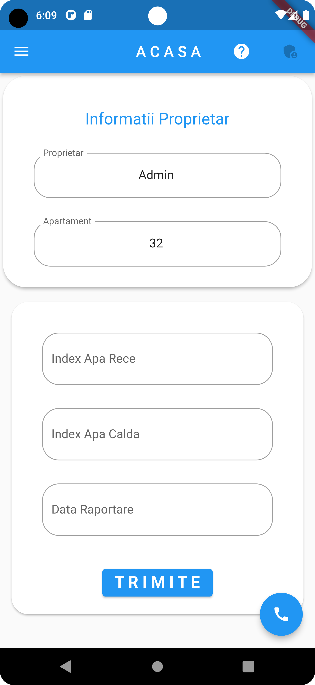
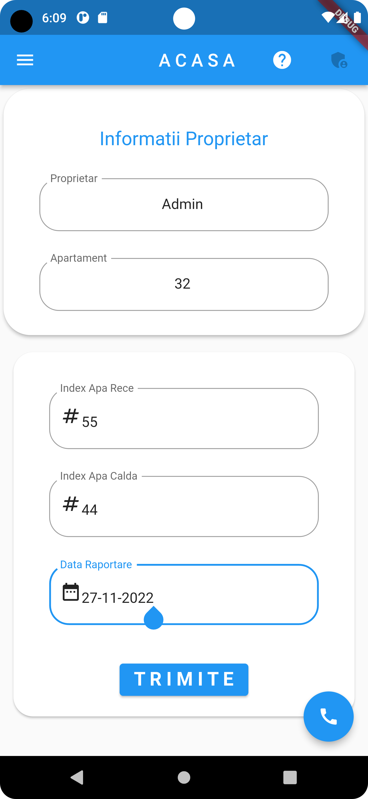
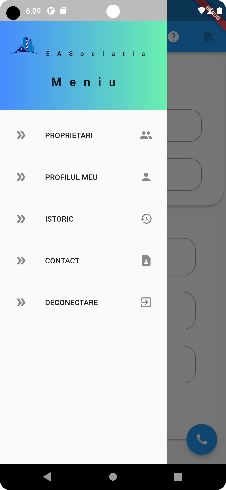
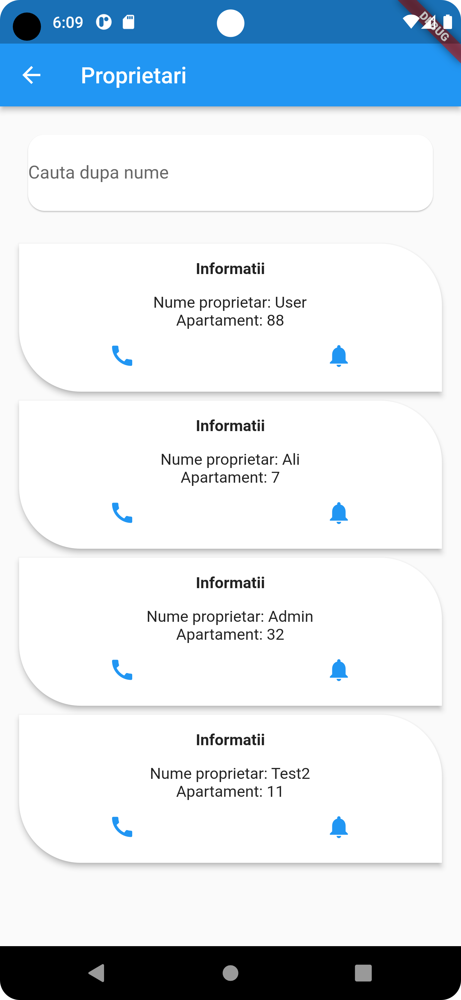
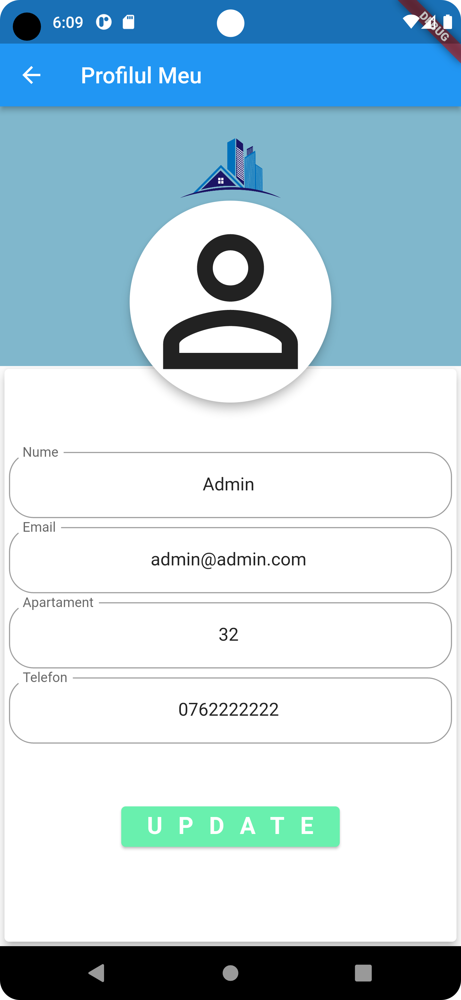
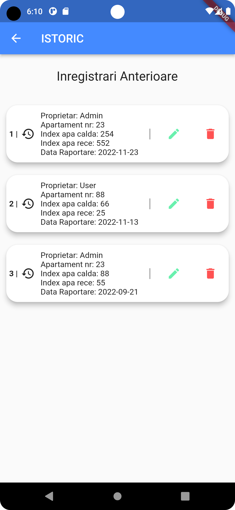
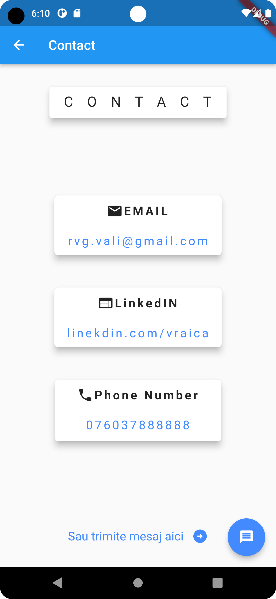
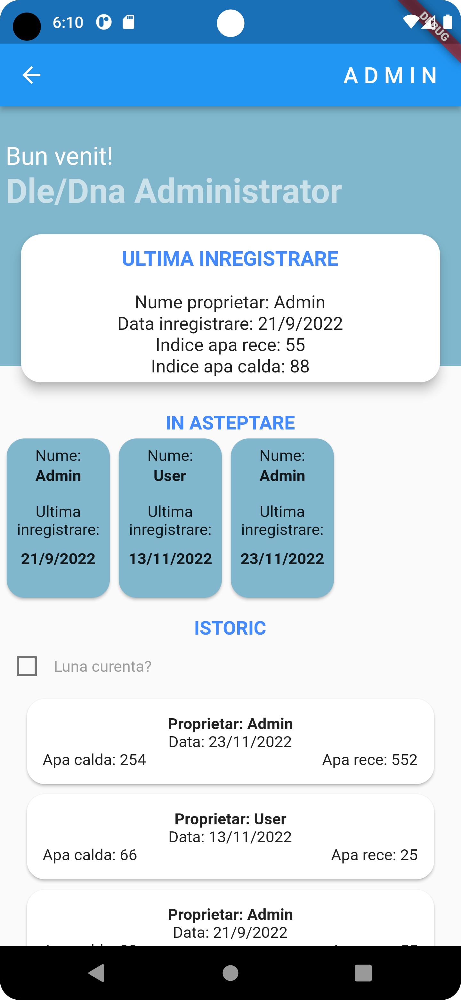

# EASOcitia  //   WIP  // first project in Flutter & Dart; learning by doing;
### Caution - you might encounter some spaghetti code - pls bear with me

Screenshots as per v1.3.0:

### Login Page

### SignUp Page

### Home Page

### Home Page - Completed

### Drawer / Menu

### List of users Page

### Profile Page

### Historical Data Page

### Contact Page

### Admin Overview Page

